# 📝 Notes App

**Notes App** is a modern and minimal note-taking application that allows users to easily create, update, archive, and delete notes. With a responsive design and user-friendly interface, it’s built for efficiency on any device.

---

## 🚀 Features

-   🗒️ **Create, Update, and Delete Notes** – Manage your notes effortlessly with a clean and intuitive interface.
-   📦 **Archive Notes** – Organize important notes separately by archiving them.
-   🔒 **Authentication** – Secure login system powered by [`better-auth`](https://github.com/n1ru4l/better-auth).
-   💡 **User-Friendly Forms** – Built with [`react-hook-form`](https://react-hook-form.com/) and [`zod`](https://zod.dev/) for form validation and accessibility.
-   ⚙️ **Modern State Management** – Efficient data and UI handling using [`zustand`](https://github.com/pmndrs/zustand) and [`react-query`](https://tanstack.com/query/latest).
-   🌐 **Responsive Design** – Fully optimized for all devices, from desktops to mobile phones.
-   ⚡ **Fast & Scalable Frontend** – Built with [`Next.js`](https://nextjs.org/) and [`TypeScript`](https://www.typescriptlang.org/).
-   🧩 **Robust Backend** – API and server-side functionality powered by [`Hono.js`](https://hono.dev/).
-   🎨 **Clean UI** – Styled using [`Tailwind CSS`](https://tailwindcss.com/) for a modern, minimal look.
-   🗃️ **Database Layer** – Uses [`Prisma`](https://www.prisma.io/) for seamless and type-safe database access.

---

## 🛠️ Tech Stack

### 🧑‍💻 Frontend

-   [Next.js](https://nextjs.org/)
-   [React](https://reactjs.org/)
-   [TypeScript](https://www.typescriptlang.org/)
-   [Tailwind CSS](https://tailwindcss.com/)

### 🔐 Authentication

-   [better-auth](https://github.com/n1ru4l/better-auth)

### ⚙️ State Management & Data Fetching

-   [Zustand](https://github.com/pmndrs/zustand)
-   [React Query](https://tanstack.com/query/latest)

### 🧾 Forms & Validation

-   [React Hook Form](https://react-hook-form.com/)
-   [Zod](https://zod.dev/)

### 🔧 Backend

-   [Hono.js](https://hono.dev/)

### 🗄️ Database

-   [Prisma](https://www.prisma.io/)

---

## Images

#### Login Page

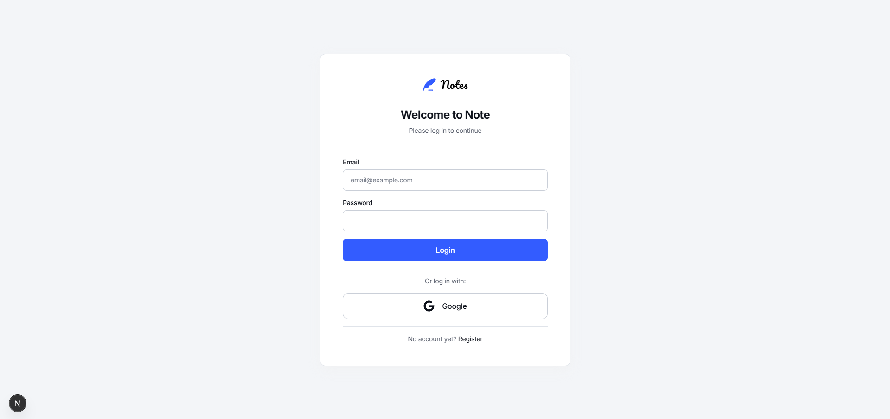

#### Login Page Error State

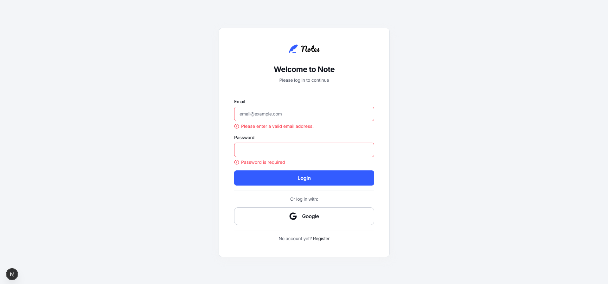

#### Register Page

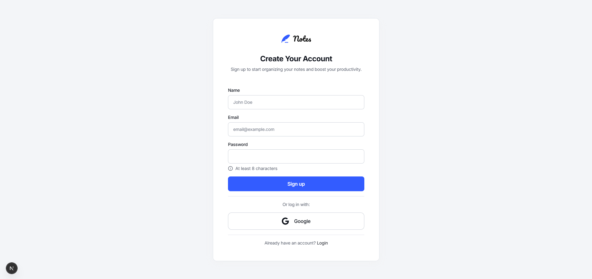

#### Notes Page

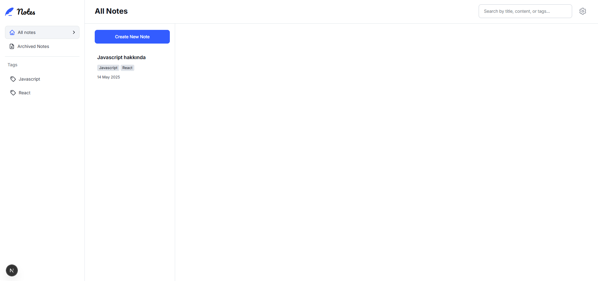

#### Note Page

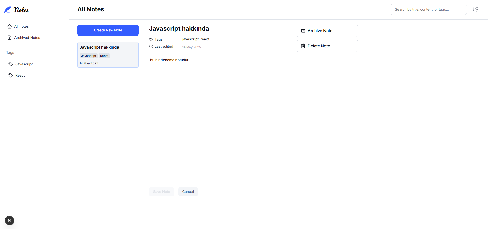

#### Archive Modal Screen

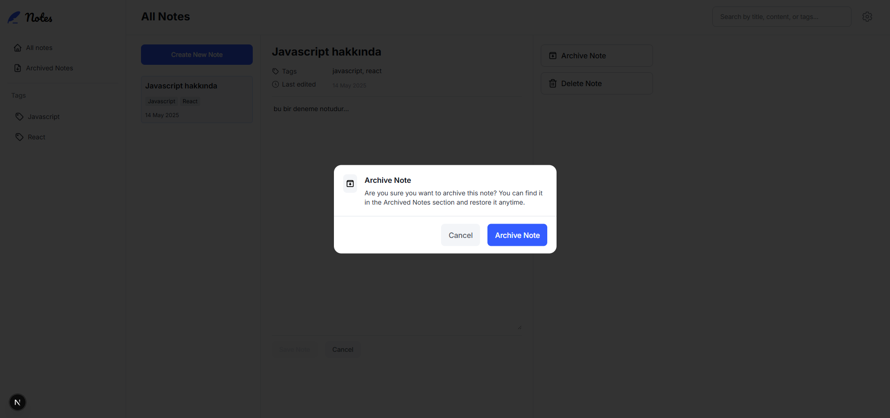

#### Delete Modal Screen

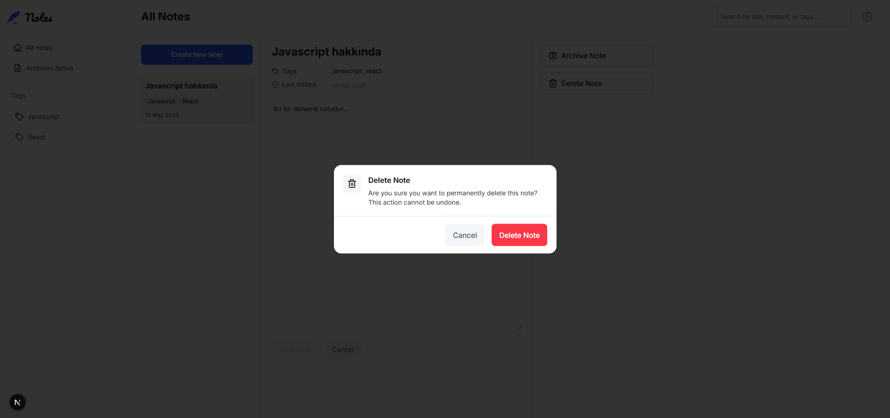

#### Color Theme Page

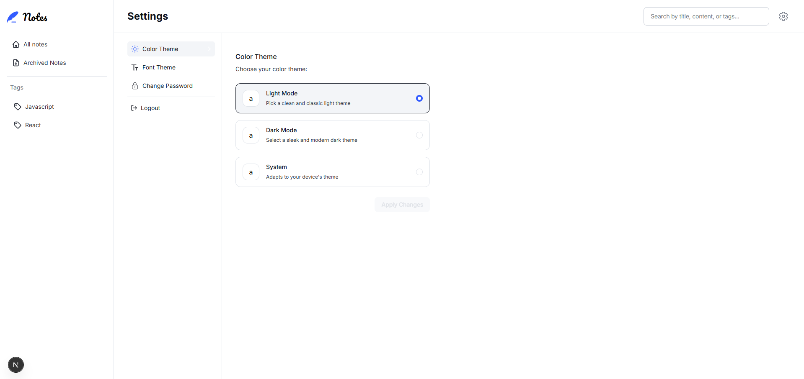

#### Dark Theme

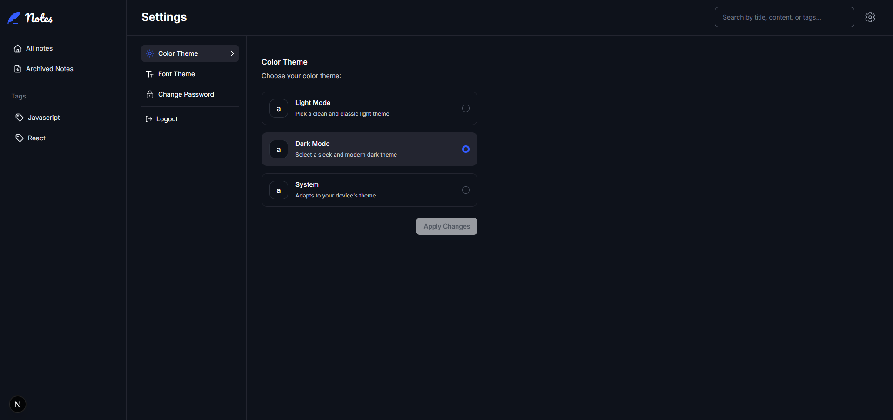

#### Change Font Page

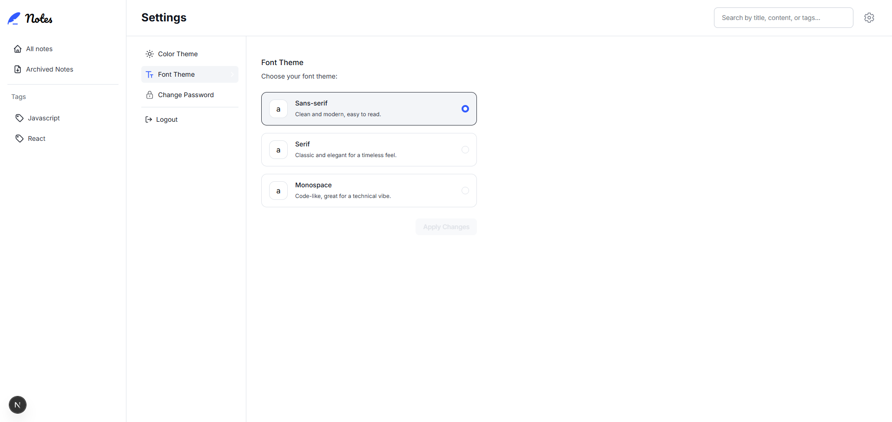

#### Font Variants

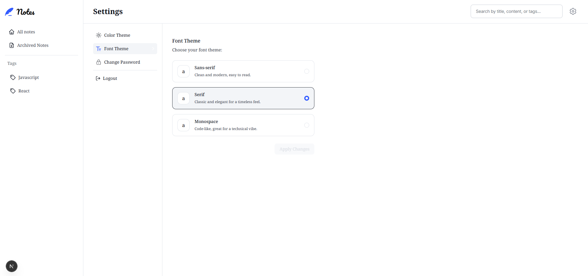

#### Mobile Screens - 1

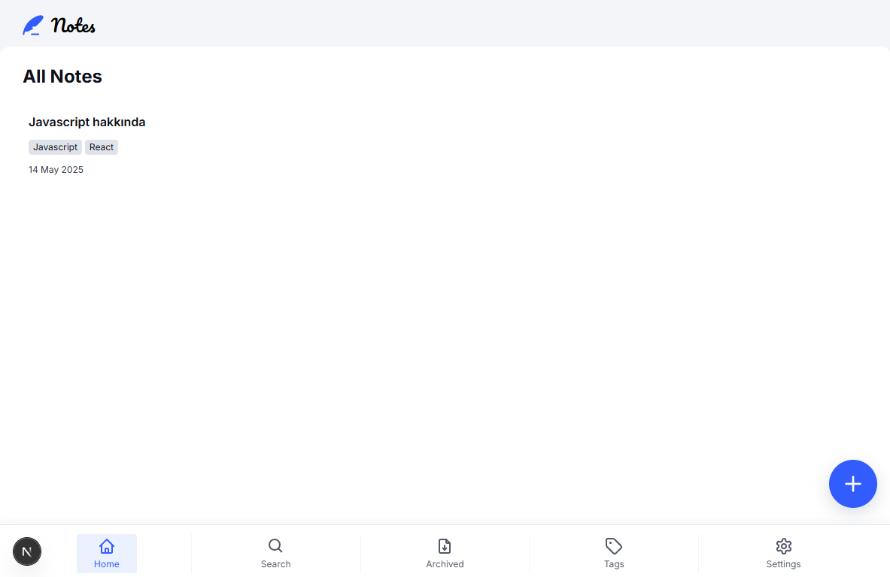

#### Mobile Screens - 2

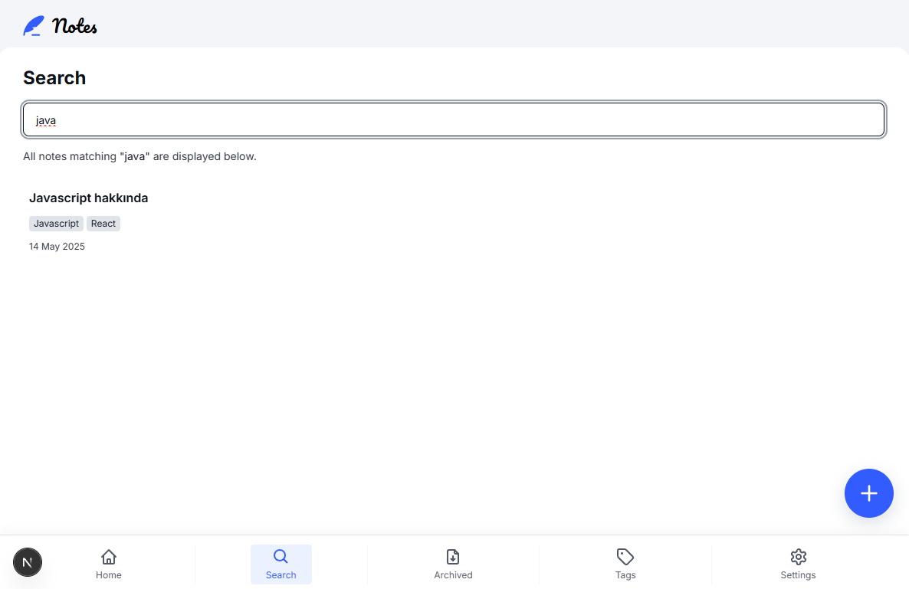

#### Mobile Screens - 3

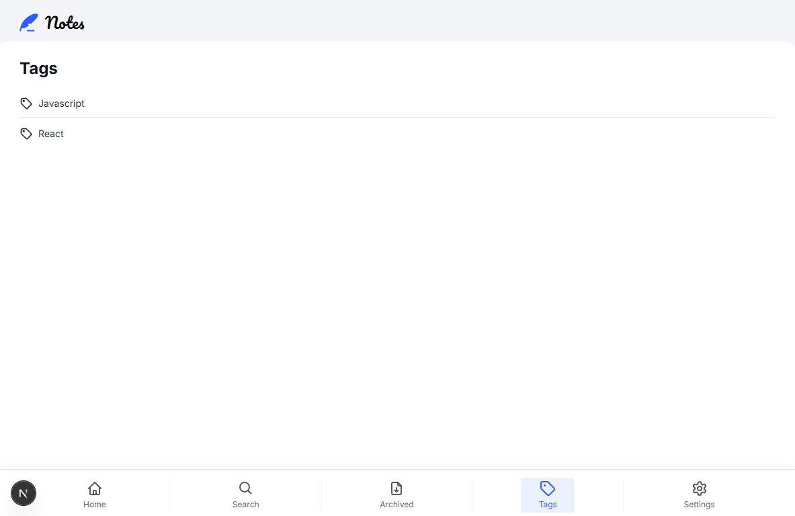

#### Mobile Screens - 4

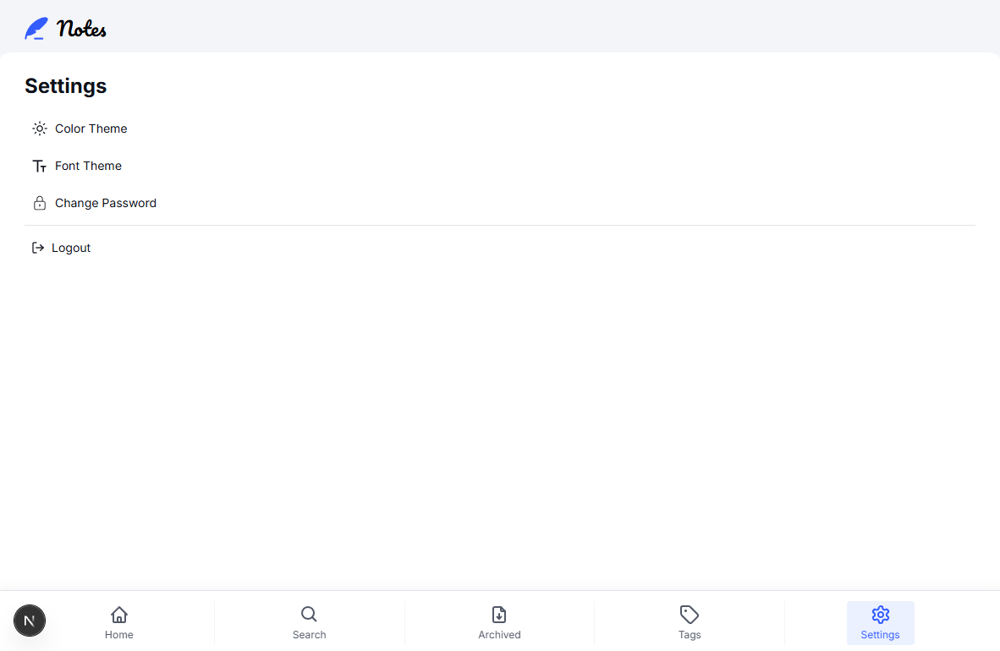

## Getting Started

First, run the development server:

```bash
npm run dev
# or
yarn dev
# or
pnpm dev
# or
bun dev
```

Open [http://localhost:3000](http://localhost:3000) with your browser to see the result.

You can start editing the page by modifying `app/page.tsx`. The page auto-updates as you edit the file.

This project uses [`next/font`](https://nextjs.org/docs/basic-features/font-optimization) to automatically optimize and load Inter, a custom Google Font.

## Learn More

To learn more about Next.js, take a look at the following resources:

-   [Next.js Documentation](https://nextjs.org/docs) - learn about Next.js features and API.
-   [Learn Next.js](https://nextjs.org/learn) - an interactive Next.js tutorial.

You can check out [the Next.js GitHub repository](https://github.com/vercel/next.js/) - your feedback and contributions are welcome!

## Deploy on Vercel

The easiest way to deploy your Next.js app is to use the [Vercel Platform](https://vercel.com/new?utm_medium=default-template&filter=next.js&utm_source=create-next-app&utm_campaign=create-next-app-readme) from the creators of Next.js.

Check out our [Next.js deployment documentation](https://nextjs.org/docs/deployment) for more details.
